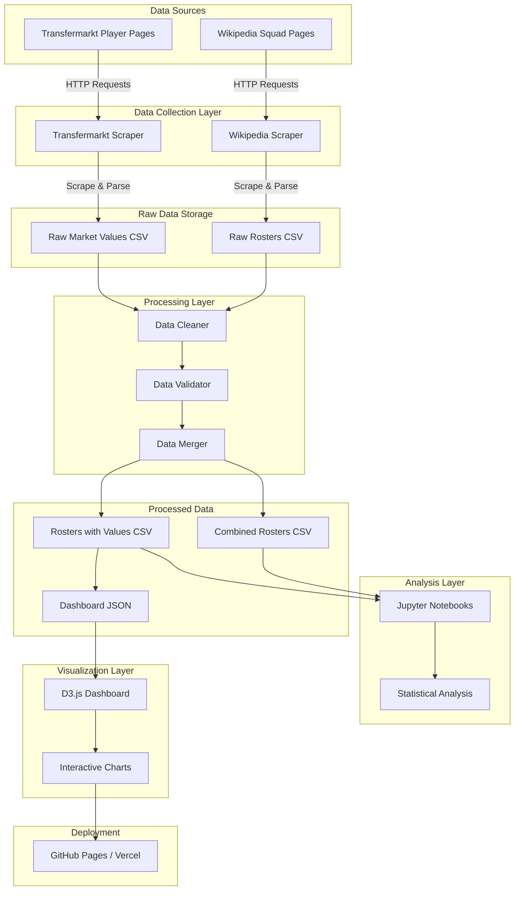
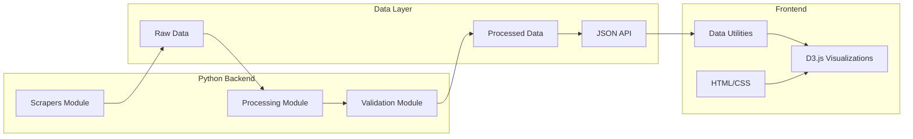
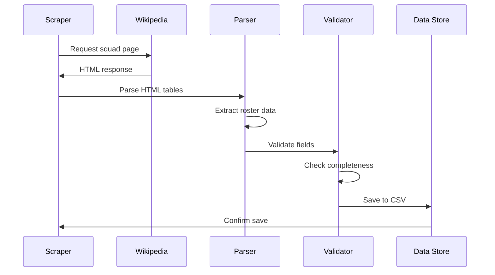
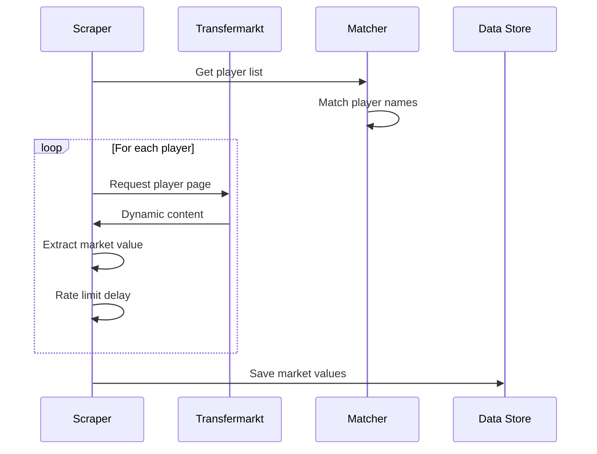
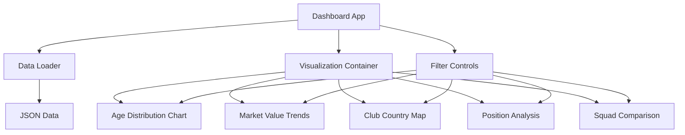
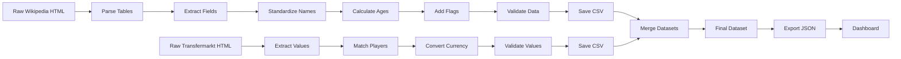
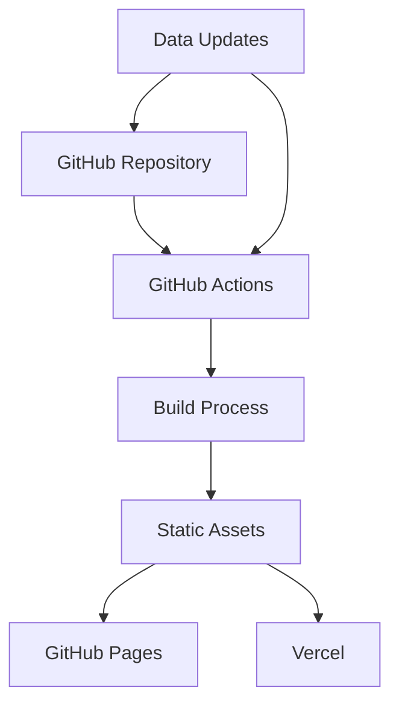
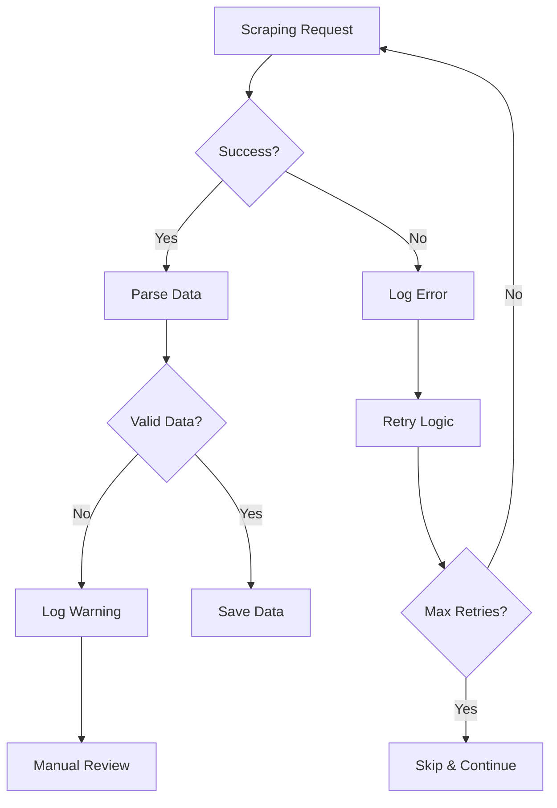

# System Architecture

## Data Flow Diagram

## Component Architecture

## Scraping Strategy

### Wikipedia Scraping Flow

### Transfermarkt Scraping Flow

## Dashboard Architecture

### Component Hierarchy

### Data Processing Pipeline

## Technology Stack Details

### Python Dependencies
- **beautifulsoup4** - HTML parsing
- **lxml** - Fast XML/HTML processing
- **requests** - HTTP client
- **selenium** or **playwright** - Dynamic content
- **pandas** - Data manipulation
- **numpy** - Numerical operations
- **jupyter** - Interactive notebooks
- **pytest** - Testing framework
- **black** - Code formatting
- **ruff** - Linting

### Frontend Dependencies
- **D3.js v7** - Data visualization
- **TopoJSON** - Geographic data
- **d3-tip** - Tooltips
- **Lodash** - Utility functions

### Development Tools
- **uv** - Python package manager
- **Git** - Version control
- **GitHub Actions** - CI/CD
- **Vite** - Build tool (optional)

## Deployment Architecture

## Security & Best Practices

### Scraping Ethics
- Respect robots.txt
- Implement rate limiting
- Cache responses
- Use appropriate user agents
- Handle errors gracefully

### Data Privacy
- No personal contact information
- Public data only
- Proper attribution
- License compliance

### Performance Optimization
- Lazy loading for large datasets
- Data pagination
- Efficient D3.js rendering
- Asset minification
- CDN for static assets

## Scalability Considerations

### Data Growth
- Current: ~8 tournaments × ~32 teams × ~23 players = ~5,888 records
- Future: Additional tournaments add ~736 records each
- Market value data: Similar scale

### Performance Targets
- Dashboard load time: < 3 seconds
- Visualization render: < 1 second
- Data file size: < 2MB compressed
- Browser support: Modern browsers (ES6+)

## Error Handling Strategy

## Monitoring & Logging

### Logging Levels
- **INFO**: Successful operations
- **WARNING**: Missing data, retries
- **ERROR**: Failed requests, parsing errors
- **DEBUG**: Detailed scraping info

### Metrics to Track
- Scraping success rate
- Data completeness percentage
- Processing time per year
- Dashboard load performance
- User interactions (optional)